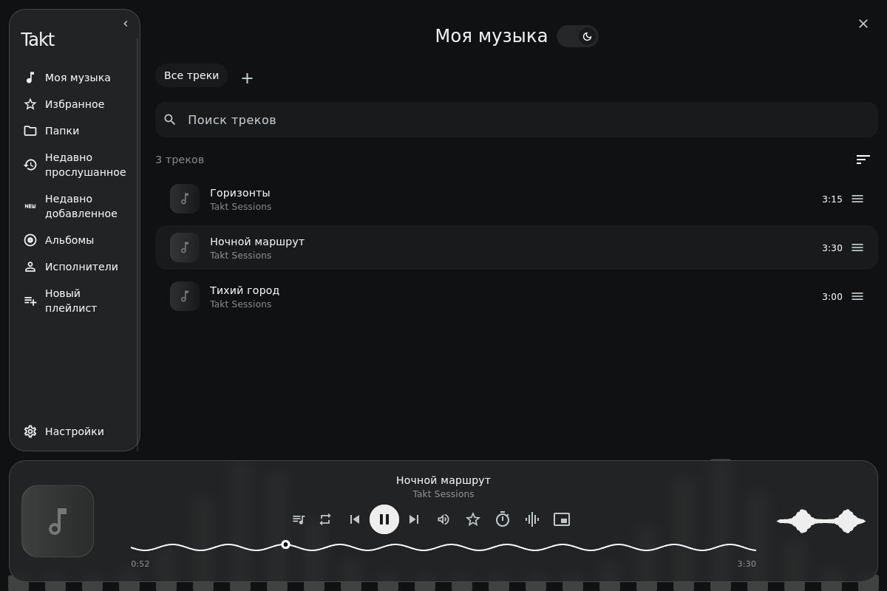

# Takt

Takt - локальный музыкальный плеер для Linux и Android 16. Он находит музыку на устройстве, собирает её в удобную библиотеку и не требует аккаунта или подписки.



## Что умеет Takt

- воспроизводит локальную музыку через libmpv;
- на Linux автоматически находит стандартную папку с музыкой, на Android сканирует системную музыкальную библиотеку;
- следит за изменениями файлов и обновляет библиотеку;
- поддерживает очередь, плейлисты и избранное;
- показывает альбомы, исполнителей, недавно добавленные и недавно прослушанные треки;
- восстанавливает очередь и позицию после перезапуска, но не включает музыку сам;
- предлагает светлую и тёмную темы, стекло, обои, акцентные цвета и пресеты оформления;
- позволяет менять расположение элементов интерфейса;
- содержит сплошной, линейный и столбчатый визуализатор;
- поддерживает таймер сна и компактный режим на Linux;
- работает с MPRIS, системными медиакнопками и треем Linux;
- на Android продолжает играть в фоне и поддерживает управление с экрана блокировки;
- имеет русский и английский интерфейс.

## Скачать

Готовые сборки находятся на странице [GitHub Releases](https://github.com/an0thrguy/Takt-Player/releases/latest).

Для Linux скачайте архив `Takt-0.3.1-linux-x86_64.tar.gz` из раздела Assets. Архивы `Source code`, которые GitHub создаёт автоматически, содержат только исходники.

Для Android 16 скачайте `Takt-0.3.1-android-arm64.apk` и откройте его на телефоне. Готовая Android-сборка рассчитана на Poco X7 и Samsung Galaxy S24 Ultra. [Инструкция для Android](docs/install-android.md).

Подробные команды и список зависимостей Linux находятся в [инструкции по установке](docs/install-linux.md).

Короткий вариант:

```bash
sha256sum --check SHA256SUMS.txt
tar -xzf Takt-0.3.1-linux-x86_64.tar.gz
cd Takt-0.3.1-linux-x86_64
./start.sh
```

Чтобы добавить Takt в меню приложений текущего пользователя:

```bash
./install.sh
```

`sudo` для установки Takt не нужен.

## Управление

Сочетания клавиш ниже относятся к Linux. На телефоне громкость меняется физическими кнопками.

- обычное нажатие на трек запускает воспроизведение;
- долгое нажатие выделяет трек;
- кнопка с тремя полосками открывает действия с треком;
- удержание этой кнопки позволяет перетащить трек;
- пробел включает и останавливает воспроизведение;
- стрелки влево и вправо перематывают трек;
- стрелки вверх и вниз меняют громкость;
- Ctrl + стрелка влево или вправо переключает трек;
- Super + Q полностью закрывает Takt, если сочетание не перехватывает рабочее окружение.

При вводе текста музыкальные сочетания клавиш не срабатывают.

## Настройка интерфейса

В настройках можно менять цвета, прозрачность, размытие, обои, размер текста, скорость анимаций и вид визуализатора. Отдельно настраиваются светлая и тёмная темы. Готовое оформление можно сохранить как пресет.

Режим редактирования интерфейса позволяет переставлять и скрывать разделы слева и кнопки на панели воспроизведения. Подробнее это описано в [руководстве по настройке](docs/customization.md).

В Hyprland компактный размер окна работает, когда окно Takt переведено в плавающий режим. Прозрачность и режим поверх окон зависят от возможностей композитора.

## Сборка Linux из исходников

Проект проверен с Flutter 3.47.6 и Dart 3.13.5. Нужны GTK 3, Clang, CMake, Ninja, pkg-config, libmpv, FFmpeg, libXi и libX11.

```bash
flutter config --enable-linux-desktop
flutter pub get --enforce-lockfile
flutter analyze
flutter test
flutter build linux --release
./tool/package.sh
```

Полезные документы:

- [подготовка Linux для разработки](docs/linux-development-setup.md);
- [карта кода](docs/code-guide.md);
- [изменения в версии 0.3.1](docs/releases/v0.3.1.md).

## Поддерживаемые системы

Готовые сборки предназначены для Linux x86_64 и Android 16 ARM64. Windows пока не входит в выпуск. Linux-сборка использует системные библиотеки, поэтому это не универсальный AppImage или Flatpak.

## Лицензии

Отдельная лицензия для собственного кода Takt пока не выбрана. Публичный доступ к исходникам сам по себе не даёт права повторно использовать их. Сторонние библиотеки сохраняют свои лицензии, а их тексты входят в архив выпуска.

Сборка APK и требования к Android описаны в [инструкции для Android](docs/install-android.md). Windows пока не входит в выпуск.
