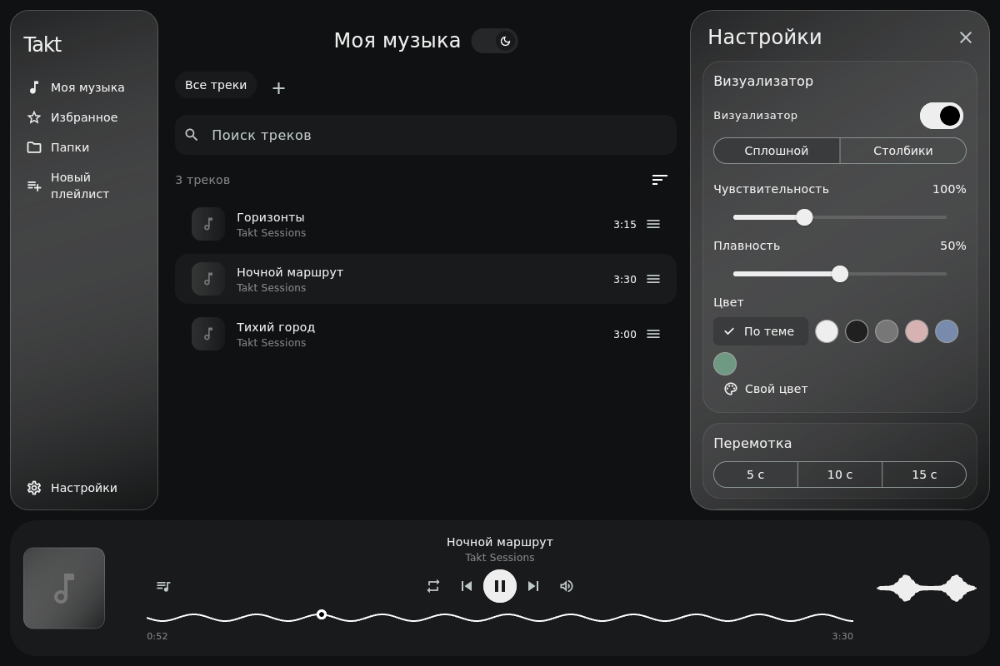

# Takt

Плеер локальной музыки для Linux / Local music player for Linux.

Минималистичный округлённый интерфейс, светлая и тёмная темы, стекло, плейлисты, избранное и частотный визуализатор. Русский и английский языки. Flutter/Dart + libmpv; локальная база SQLite.

## Скачать и установить / Download and install

**[Последний выпуск / Latest release](https://github.com/an0thrguy/Takt-Player/releases/latest)**

Выберите `Takt-0.2.0-linux-x86_64.tar.gz` в Assets. Кнопка GitHub «Download ZIP» и файлы «Source code» содержат исходники, а не готовое приложение.

**[Подробная инструкция на русском и английском](docs/install-linux.md)**

После установки зависимостей:

```bash
tar -xzf Takt-0.2.0-linux-x86_64.tar.gz
cd Takt-0.2.0-linux-x86_64
./start.sh
# Необязательно: добавить Takt в меню приложений, без sudo.
./install.sh
```

The binary is for Linux **x86_64**. Download the release `.tar.gz`, install the documented runtime dependencies, extract the entire folder, and run `./start.sh`. Flutter is only needed when building from source. The release is built on Ubuntu 22.04; it uses system libraries and is not a universal AppImage/Flatpak. Other distributions are not all verified. Android, ARM and Windows builds are not included.



## Использование

При первом запуске Takt использует стандартную папку XDG Music или `~/Music` / `~/Музыка`, если она существует. Иначе откроется выбор музыкальной папки. Дополнительные папки подключаются в настройках. Изменения файлов появляются автоматически при проверке раз в 10 секунд.

Одиночное нажатие на песню запускает текущий список. Удержание строки выделяет её. Три полоски открывают меню; удержание полосок позволяет переставить всю строку. Плейлисты находятся после «Все треки», поле создания открывается кнопкой «+».

Панель воспроизведения: режим очереди, предыдущая песня, пуск/пауза, следующая песня, громкость. Текущая очередь открывается кнопкой с нотами слева от управления или нажатием на обложку. Режимы: по кругу, один проход, перемешивание, повтор песни.

После перезапуска очередь и позиция восстанавливаются на паузе. Название и обложка меняются только внутри Takt. Удаление файла с устройства требует отдельного подтверждения.

«Избранное» находится слева; добавить или убрать песню можно через звёздочку в меню строки. Новые песни добавляются в конец очереди без повторов.

Пробел — пуск/пауза, стрелки влево/вправо — перемотка, вверх/вниз — громкость, Ctrl + влево/вправо — предыдущая/следующая песня. При вводе текста эти сочетания не мешают печатать. Шаг перемотки выбирается в настройках: 5, 10 или 15 секунд.

Настройки открываются справа над панелью воспроизведения. Визуализатор анализирует частоты музыки: доступны сплошная волна и столбики, чувствительность, плавность и отдельный цвет. Его можно выключить. Пауза при отключении наушников включена по умолчанию; автоматического продолжения нет. Для проводных наушников определение зависит от доступности состояния разъёма в звуковом драйвере.

Закрытие по умолчанию сворачивает плеер в трей. Настройка позволяет завершать приложение. Если доступного трея нет, окно остаётся открытым. Явный выход — Super + Q, настройки и меню трея. Сочетание завершает приложение, даже если закрытие окна настроено на трей. В Hyprland системный Super + Q может перехватывать это сочетание: для корректного выхода можно подключить `tool/super-q.py` вручную или использовать меню трея/настройки. Трей требует поддержки StatusNotifier рабочим окружением.

Сетевой поиск обложек выключен. Его можно разрешить в настройках; запрос содержит метаданные песни, музыкальный файл не отправляется. Локальные и встроенные обложки используются без интернета.

Окно без системной верхней полосы: плавающее окно можно перемещать за заголовок «Моя музыка» или название плейлиста. Внутренние меню, вкладки и настройки открываются плавно.

## Разработка / Build from source

Flutter **3.47.6**, Dart **3.13.5**; зависимости закреплены в `pubspec.lock`. Понадобятся Clang, CMake, Ninja, pkg-config, заголовки GTK 3/X11/Xi, libmpv и FFmpeg. На Ubuntu:

```bash
sudo apt install clang cmake ninja-build pkg-config libgtk-3-dev libx11-dev libxi-dev libmpv-dev ffmpeg libglu1-mesa
flutter config --enable-linux-desktop
flutter pub get --enforce-lockfile
flutter analyze
flutter test
flutter build linux --release
./tool/package.sh
./tool/run.sh
```

[Карта кода / Editing guide](docs/code-guide.md) · [Release notes](docs/releases/v0.2.0.md) · [Third-party notices](THIRD_PARTY_NOTICES.md)

English comments identify the main customization points. GitHub Actions builds on Ubuntu 22.04, checks the app, produces the archive and SHA-256 checksums, and publishes a release only when explicitly dispatched with publication enabled. It never replaces an existing published version.

## Переиспользование / Licensing

Лицензия переиспользования собственного кода Takt пока не выбрана. Публичная доступность исходников сама по себе не означает MIT/GPL-лицензию. Сторонние компоненты сохраняют свои лицензии; их тексты входят в архив. / An open-source reuse license for Takt's own code has not yet been selected. Third-party components retain their original licenses.
